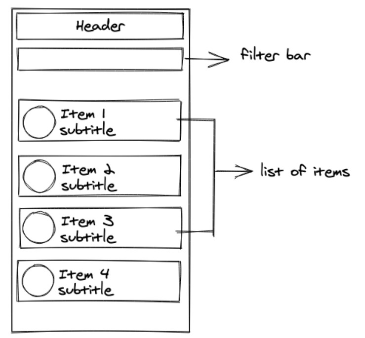
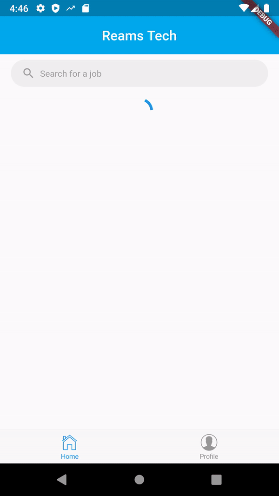

# Reamstech flutter challenge

### Background
It is a common pattern on the frontend that we obtain some kind of payload in the form of JSON from the backend server. This payload is then transformed into some form that allows Flutter components to render.

### Requirements
In this challenge, you are required to:

- Download the .json file in the appendix section below
- Create a new Flutter project
- Import the .json file into your component file
- Render a simple widget displaying the JSON payload

   
### UI Reference

   
### Final result

State management used:  Get package

CI/CD used: Codemagic webhook

